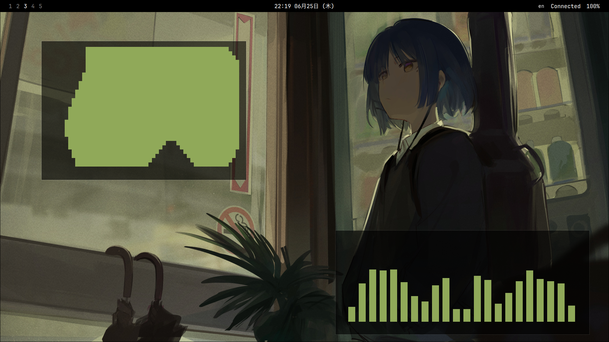
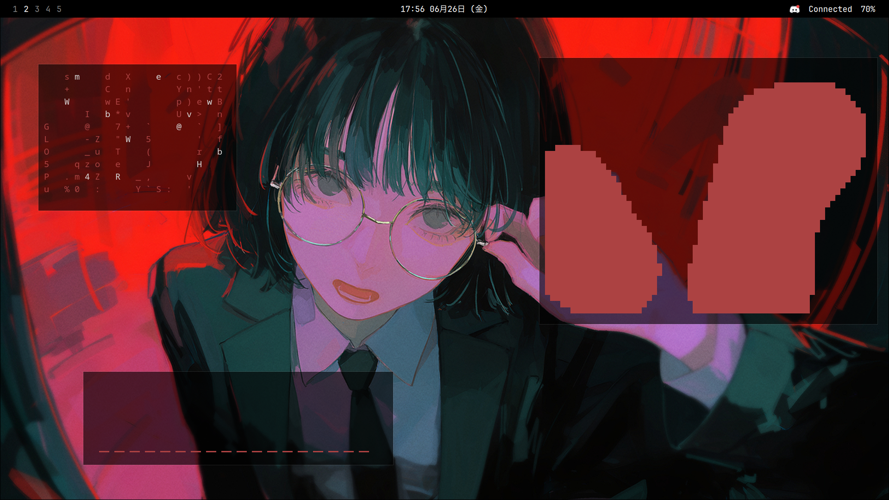
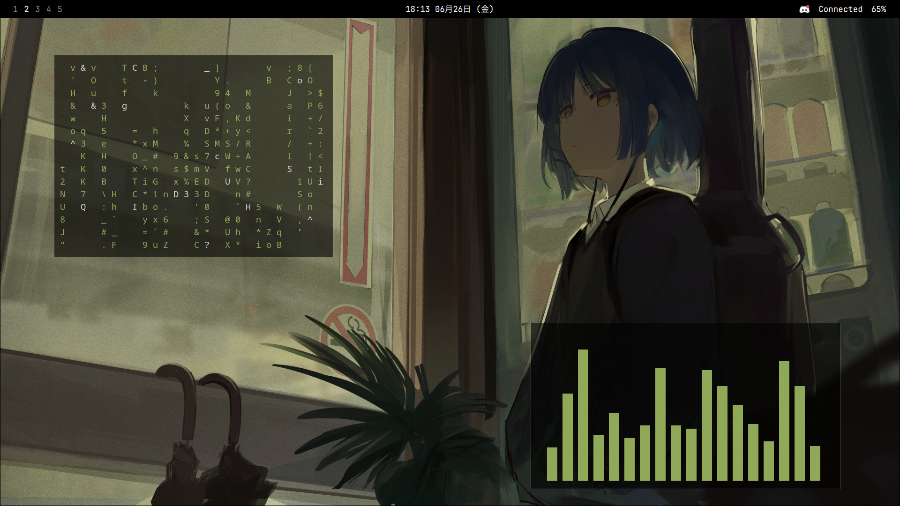
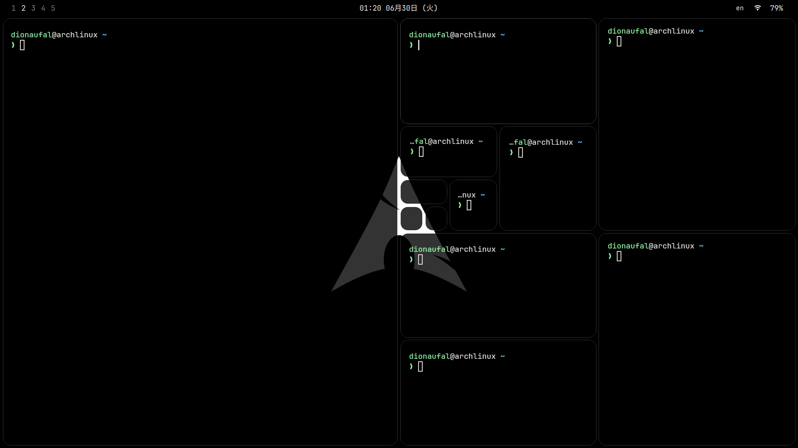
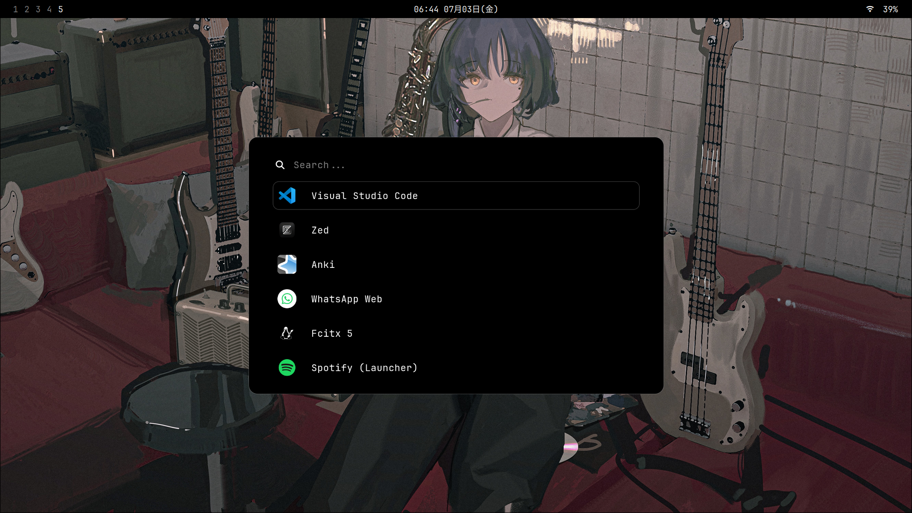
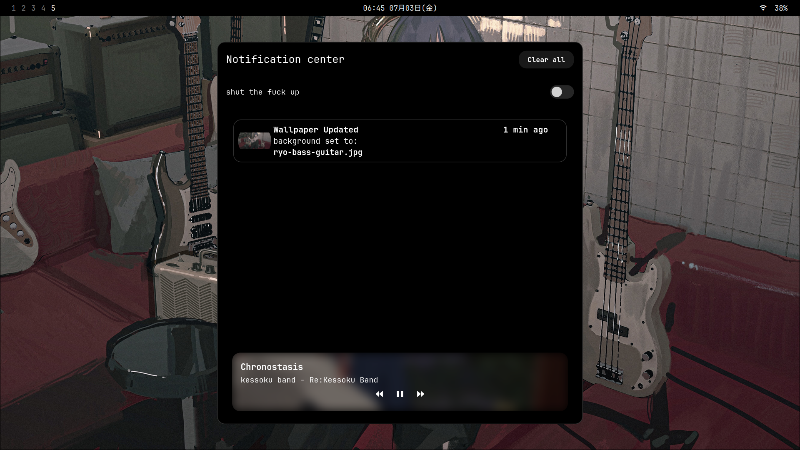
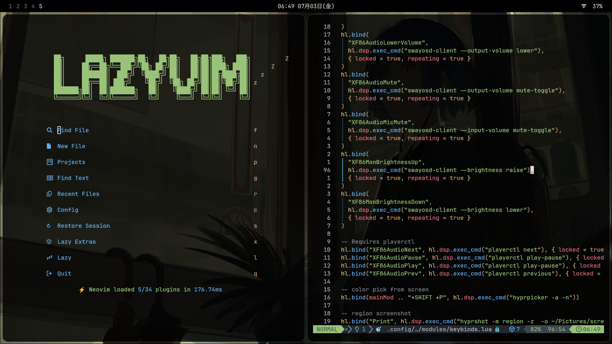
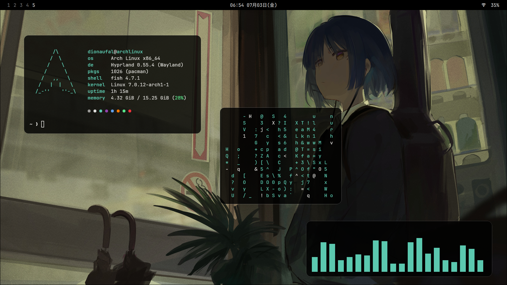

### 💳 Credits

Made this so i dont have to reconfig all programs from the start after a fresh install. i actually got the rofi configs from binnewbs (https://github.com/binnewbs/arch-hyprland) and also JaKooLit (https://github.com/JaKooLit), then tweaked it a bit. thanks gemini for making the fuzzel/rofi wallpaper switcher script xd

### ⚙️ Apps
File explorer: dolphin  
Terminal: kitty 
Launcher: rofi 
Notification Daemon: swaync  
Browser: helium 
Shell: fish <b/>

### 📸 Screenshots

<table>
<tr>
<td></td>
<td></td>
</tr>
<tr>
<td></td>
<td></td>
</tr>
<tr>
<td></td>
<td></td>
</tr>
<tr>
<td></td>
<td></td>
</tr>
</table>
